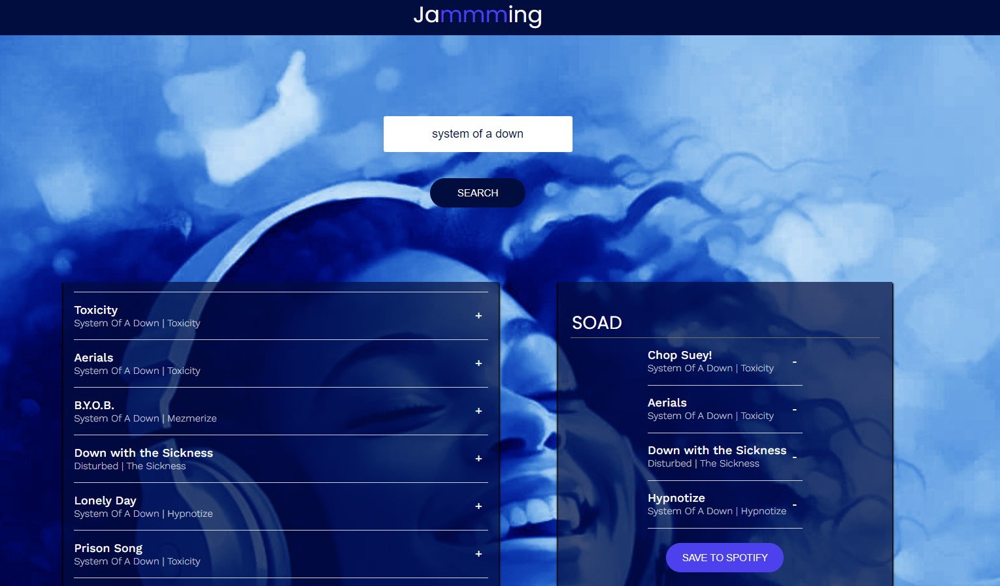

# Jammming

## Table of contents

- [Overview](#overview)
  - [Objective](#objective)
  - [Background](#background)
  - [The challenge](#the-challenge)
  - [Screenshot](#screenshot)
  - [Links](#links)
- [My process](#my-process)
  - [Built with](#built-with)
  - [What I learned](#what-i-learned)
  - [Continued development](#continued-development)
- [Author](#author)

## Overview

### Objective

To give users the ability to update all of their Spotify playlists and save them to Spotify.

### Background

Currently, Jammming supports the ability to create one new playlist at a time and save it to Spotify. However, updating an existing playlist is not supported. With over 5 million playlists created or edited daily on Spotify, this is key functionality to support.

### The challenge

Users should be able to:

- Search for Businesses: Users can enter a search term (like a type of cuisine) and a location to find businesses matching their criteria.

- Sort Results: They can choose how the results are sorted (by best match, highest rated, or most reviewed).

- View Business Listings: Once the search is executed, users can see a list of businesses that match their search criteria, including images, names, addresses, ratings, and review counts.

- Handle Errors: The app handles errors gracefully, displaying an error message if there's an issue with the Yelp API or any other part of the process.

- Loading State: During the search, users see a loading indicator to know that the app is fetching data.

- Responsive Design: The app is designed to be responsive, ensuring it works well on different screen sizes and devices.

- User-Friendly Interface: Overall, the app provides a clean and user-friendly interface that makes it easy for users to search for and explore different businesses based on their preferences.

### Screenshot

### Links

- Live Site URL: [View](https://jammming624.netlify.app/)

## My process

- **Create Static Components**: Build the basic structure of your app using React components, including static versions of SearchBar, SearchResults, Playlist, and TrackList.

- **Pass Down Search Result and Render Result List**: Implement logic to pass search results from the parent component to the SearchResults component and render a list of tracks.

- **Pass Down Playlist to TrackList**: Ensure that the current playlist is passed down as props to the TrackList component so it can render the tracks in the playlist.

- **Add Tracks to a Playlist**: Create functionality that allows users to add tracks from the search results to their playlist by clicking an "Add" button.

- **Remove Tracks from a Playlist**: Implement a feature that enables users to remove tracks from their playlist by clicking a "Remove" button.

- **Change the Name of a Playlist**: Add an input field that allows users to change the name of their playlist and update the state accordingly.

- **Create a Method that Saves the Playlist to a User's Account**: Develop a method that uses the Spotify API to save the user's playlist to their Spotify account.

- **Hook up Search Bar to Spotify Search**: Connect the SearchBar component to the Spotify API so that users can search for tracks and get results displayed in the SearchResults component.

- **Obtain a Spotify Access Token**: Implement authentication logic to obtain an access token from Spotify, allowing you to make authorized requests to the Spotify API.

- **Implement Spotify Search Request**: Write the logic to make a search request to the Spotify API using the access token and fetch the search results.

- **Save a User's Playlist**: Use the Spotify API to save the user's playlist, including creating a new playlist and adding tracks to it, and then update the UI to reflect the saved state.

### Built with

- Semantic HTML5 markup
- CSS custom properties
- Flexbox
- Mobile-Responsive Design
- JavaScript - Scripting language
- [React](https://reactjs.org/) - JS library

### What I learned

This is a project testing all I know on react. I used CRUD methods for API operations.

### Continued development

- Include preview samples for each track
- Only display songs not currently present in the playlist in the search results
- Add a loading screen while playlist is saving
- Update the access token logic to expire at exactly the right time, instead of setting expiration from when the user initiates their next search
- After user redirect on login, restoring the search term from before the redirect
- Ensure playlist information doesn’t get cleared if a user has to refresh their access token

## Author

- Website - [Cameron Howze](https://camkol.github.io/)
- Frontend Mentor - [@camkol](https://www.frontendmentor.io/profile/camkol)
- GitHub- [@camkol](https://github.com/camkol)
- LinkedIn - [@cameron-howze](https://www.linkedin.com/in/cameron-howze-28a646109/)
- E-Mail - [cameronhowze4@outlook.com](mailto:cameronhowze4@outlook.com)
